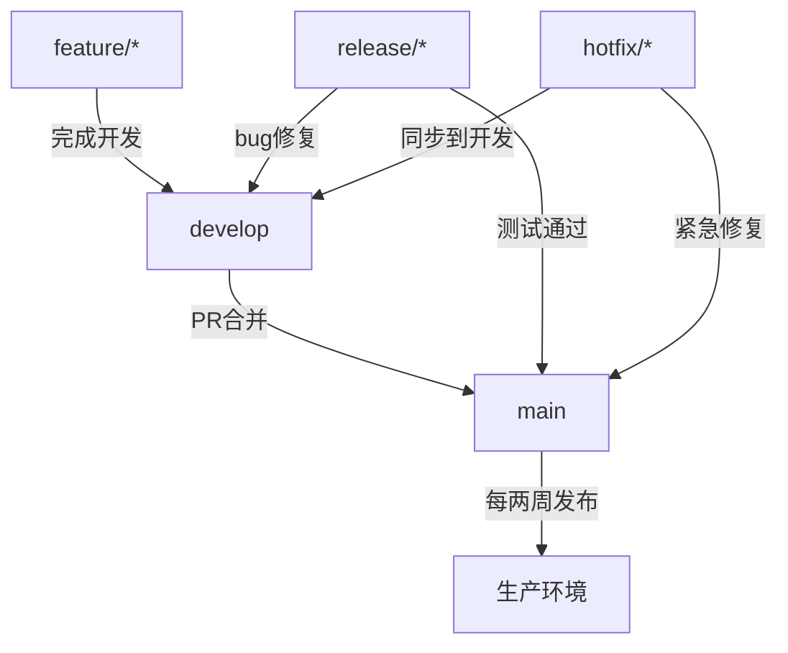

# 设计团队协作的Git工作流

## 背景

不同的团队和项目有不同的开发需求、发布频率和协作模式。选择合适 Git 工作流对于提高开发效率、保证代码质量和简化发布流程至关重要。

## 任务

为一个假设的软件开发团队设计一套完整的 Git 工作流方案，该团队有以下特点：

- **团队规模**：8名开发者
- **项目类型**：Web 应用（前端 + 后端）
- **发布频率**：每两周一次正式发布，但支持紧急热修复
- **质量要求**：高，需要代码审查和自动化测试
- **部署环境**：开发、测试、预生产、生产四个环境

## 要求

你的设计方案应包含以下内容：

### 1. 分支策略

- 描述主要分支（如 main、develop 等）的作用和生命周期
- 定义特性分支、发布分支、热修复分支的命名规范和使用流程
- 说明各分支之间的合并策略（merge vs rebase vs squash）

### 2. 提交规范

- 定义提交信息格式（建议使用 Conventional Commits）
- 说明何时应该拆分提交，何时应该合并提交
- 提供提交信息模板和示例

### 3. 代码审查流程

- 描述 Pull Request/Merge Request 的创建和审查流程
- 定义审查标准（至少需要多少个批准、哪些文件需要特别关注等）
- 说明如何处理审查反馈和修改

### 4. 自动化集成

- 设计 CI/CD 流程，包括哪些检查在什么阶段运行
- 说明如何集成 Git 钩子（pre-commit、pre-push 等）
- 描述自动化测试策略（单元测试、集成测试、E2E 测试）

### 5. 发布管理

- 详细描述从开发到生产的完整发布流程
- 说明如何处理紧急热修复
- 定义版本号管理策略（语义化版本控制）

### 6. 冲突解决

- 提供处理合并冲突的最佳实践
- 说明如何避免频繁冲突
- 描述复杂冲突的解决流程

## 交付物

创建一个 `git-workflow-design.md` 文件，包含上述所有内容。文档应该：

- 结构清晰，易于理解
- 包含具体的命令示例和流程图（可以用 Mermaid 语法）
- 考虑实际操作中的常见问题和解决方案
- 适合新团队成员快速上手

## 示例片段

## 评估标准

- **完整性**：覆盖所有要求的方面
- **实用性**：方案在实际项目中可执行
- **清晰性**：文档易于理解和遵循
- **创新性**：考虑了团队特定需求的优化

⭐⭐⭐ 难度：较难
预计完成时间：90-120分钟