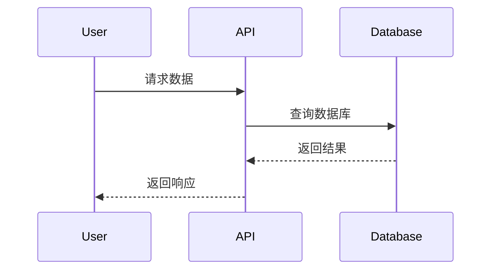

# 文档即代码：Markdown/Diagrams

## 开场白

在软件开发中，文档常常被称为"被遗忘的艺术"。我们都知道文档的重要性——它帮助新团队成员快速上手，为用户提供了使用指南，记录了系统的设计决策。然而，在实际项目中，文档往往要么缺失，要么过时，最终变成维护的负担。

为什么会出现这种情况？主要原因是我们传统上将文档视为与代码分离的产物。文档写在Word文档、Wiki页面或静态HTML中，与代码库脱节。当代码发生变化时，没有人记得去更新文档，或者更新文档需要额外的工具和流程。

"文档即代码"（Docs as Code）的理念正是要解决这个问题。通过将文档当作代码一样对待——使用版本控制、自动化测试、持续集成——我们可以确保文档始终保持最新，并且与代码同步演进。

## 核心概念

### 什么是文档即代码？

文档即代码是一种将技术文档的创建、维护和发布过程应用软件开发最佳实践的方法。核心思想包括：

1. **版本控制**：文档存储在与代码相同的版本控制系统中（通常是Git）
2. **轻量级格式**：使用纯文本格式如Markdown，便于diff和合并
3. **自动化生成**：从代码注释、API定义等自动生成文档
4. **持续集成**：文档构建和验证作为CI/CD流水线的一部分
5. **协作友好**：支持Pull Request、Code Review等开发工作流

### 主要工具和技术

- **Markdown**：轻量级标记语言，易于阅读和编写
- **图表即代码**：Mermaid、PlantUML等工具允许用代码定义图表
- **文档生成器**：MkDocs、Docusaurus、Sphinx等静态站点生成器
- **API文档工具**：OpenAPI/Swagger规范和相关工具链
- **集成工具**：与GitHub Actions、GitLab CI等CI系统的集成

这种方法的优势在于：
- 文档与代码保持同步
- 利用现有的开发工具和流程
- 降低文档维护成本
- 提高文档质量和一致性

## 代码演示

让我们通过三个实际的例子来演示文档即代码的核心概念：

### 示例1：从Python docstrings生成Markdown文档

```python
# example-01-markdown-generator.py
import inspect
from typing import Any, Callable, Dict, List, Optional

def extract_function_docs(func: Callable) -> Dict[str, Any]:
    """从函数对象提取文档信息"""
    sig = inspect.signature(func)
    docstring = func.__doc__ or "无文档说明"
    
    return {
        "name": func.__name__,
        "signature": str(sig),
        "docstring": docstring.strip(),
        "module": func.__module__
    }

def generate_markdown_docs(functions: List[Callable]) -> str:
    """生成Markdown格式的文档"""
    markdown = "# API 文档\n\n"
    
    for func in functions:
        info = extract_function_docs(func)
        markdown += f"## `{info['name']}`\n\n"
        markdown += f"**签名**: `{info['signature']}`\n\n"
        markdown += f"{info['docstring']}\n\n"
        markdown += "---\n\n"
    
    return markdown
```

### 示例2：生成Mermaid图表代码

```python
# example-02-diagrams-as-code.py
def generate_class_diagram(classes: Dict[str, List[str]]) -> str:
    """根据类定义生成Mermaid类图"""
    mermaid = "classDiagram\n"
    
    for class_name, methods in classes.items():
        mermaid += f"    class {class_name} {{\n"
        for method in methods:
            mermaid += f"        +{method}\n"
        mermaid += "    }\n"
    
    return mermaid

def generate_sequence_diagram(steps: List[Dict[str, str]]) -> str:
    """根据步骤列表生成Mermaid序列图"""
    mermaid = "sequenceDiagram\n"
    participants = set()
    
    for step in steps:
        participants.add(step["actor"])
        participants.add(step["target"])
    
    for participant in sorted(participants):
        mermaid += f"    participant {participant}\n"
    
    for step in steps:
        mermaid += f"    {step['actor']}->{step['target']}: {step['action']}\n"
    
    return mermaid
```

### 示例3：生成OpenAPI规范

```python
# example-03-api-docs.py
def generate_openapi_spec(endpoints: List[Dict[str, Any]]) -> Dict[str, Any]:
    """根据端点定义生成OpenAPI规范"""
    spec = {
        "openapi": "3.0.0",
        "info": {
            "title": "自动生成的API文档",
            "version": "1.0.0",
            "description": "基于Python函数定义生成的OpenAPI规范"
        },
        "paths": {}
    }
    
    for endpoint in endpoints:
        path = endpoint["path"]
        method = endpoint["method"].lower()
        operation = {
            "summary": endpoint.get("summary", ""),
            "description": endpoint.get("description", ""),
            "responses": {
                "200": {
                    "description": "成功响应"
                }
            }
        }
        
        if path not in spec["paths"]:
            spec["paths"][path] = {}
        spec["paths"][path][method] = operation
    
    return spec
```

这些示例展示了如何用代码的方式处理文档生成，使得文档能够随着代码的变化而自动更新。

## 深入理解

### Markdown的优势与局限

Markdown作为一种轻量级标记语言，具有以下优势：
- **简洁易读**：纯文本格式，即使不渲染也能理解
- **版本友好**：Git diff可以清晰显示变更
- **广泛支持**：几乎所有平台都支持Markdown
- **可扩展性**：支持代码块、表格、数学公式等扩展语法

然而，Markdown也有局限性：
- 功能相对有限，复杂的布局难以实现
- 不同解析器的实现可能存在差异
- 缺乏语义化结构，对SEO不够友好

### 图表即代码的工作原理

Mermaid和PlantUML等工具通过特定的语法定义图表结构：
- **声明式语法**：描述图表元素及其关系，而非绘制过程
- **文本格式**：便于版本控制和协作编辑
- **实时渲染**：许多编辑器和平台支持实时预览

例如，Mermaid的序列图语法：


### 文档生成器的选择

不同的文档生成器适用于不同场景：

- **MkDocs**：简单易用，适合中小型项目，主题丰富
- **Docusaurus**：功能强大，适合大型项目，支持多版本、国际化
- **Sphinx**：Python生态首选，支持reStructuredText和Markdown
- **VuePress**：基于Vue.js，适合前端项目文档

选择时需要考虑项目规模、团队技术栈、功能需求等因素。

## 实际应用

### 在项目中实施文档即代码

1. **初始化文档结构**
   ```bash
   # 使用MkDocs创建文档项目
   mkdocs new docs
   ```

2. **配置CI/CD流水线**
   ```yaml
   # .github/workflows/docs.yml
   name: Build and Deploy Docs
   on:
     push:
       branches: [main]
   jobs:
     deploy:
       runs-on: ubuntu-latest
       steps:
         - uses: actions/checkout@v2
         - uses: actions/setup-python@v2
         - run: pip install mkdocs
         - run: mkdocs build
         - uses: peaceiris/actions-gh-pages@v3
           with:
             github_token: ${{ secrets.GITHUB_TOKEN }}
             publish_dir: ./site
   ```

3. **自动化API文档生成**
   - 使用Sphinx的autodoc扩展
   - 集成Swagger UI展示OpenAPI规范
   - 在构建过程中自动生成文档

### 团队协作最佳实践

- **文档审查**：将文档变更纳入Code Review流程
- **文档模板**：为不同类型的文档提供标准模板
- **文档负责人**：指定文档维护责任人
- **文档质量检查**：使用工具检查链接有效性、拼写错误等

### 常见工具链组合

- **Python项目**：Sphinx + autodoc + ReadTheDocs
- **JavaScript项目**：Docusaurus + JSDoc + GitHub Pages
- **通用项目**：MkDocs + Mermaid + Netlify
- **API项目**：Swagger/OpenAPI + Swagger UI + Postman

## 常见误区

### 误区1：文档即代码就是写更多文档

实际上，文档即代码的重点不是增加文档数量，而是提高文档质量和维护效率。目标是让必要的文档更容易维护，而不是强制要求文档覆盖所有细节。

### 误区2：自动生成的文档总是准确的

自动生成的文档依赖于源代码的质量。如果代码缺乏适当的注释或类型信息，生成的文档可能不完整或难以理解。自动生成应该与人工编写相结合。

### 误区3：一次设置，永远有效

文档工具链需要持续维护和更新。随着项目发展，文档需求也会变化，需要定期评估和调整文档策略。

### 误区4：所有人都需要同样的文档

不同角色需要不同类型的文档：
- **开发者**：API文档、架构文档、贡献指南
- **用户**：使用手册、教程、FAQ
- **运维人员**：部署文档、监控指南、故障排除

文档即代码应该支持针对不同受众的文档生成。

### 误区5：文档工具越复杂越好

复杂的工具链可能带来更多的维护负担。应该根据实际需求选择合适的工具，避免过度工程化。

## 动手实践

### 练习1：创建简单的Markdown文档生成器

使用提供的`example-01-markdown-generator.py`作为基础，扩展功能以支持：
- 类文档生成
- 模块级别的文档提取
- 输出到文件而非仅返回字符串

### 练习2：实现Mermaid图表生成

基于`example-02-diagrams-as-code.py`，实现以下功能：
- 支持状态图生成
- 从JSON配置文件读取图表定义
- 添加错误处理和验证

### 练习3：完整的OpenAPI生成器

扩展`example-03-api-docs.py`以支持：
- 请求/响应体的详细定义
- 参数验证规则
- 安全方案定义
- 输出为YAML格式

### 挑战项目

1. **集成现有项目**：选择一个现有的开源项目，为其添加文档即代码的支持
2. **自定义文档生成器**：创建一个能够从多种源（代码、数据库schema、配置文件）生成统一文档的工具

## 小结与思考

文档即代码不仅仅是一种技术实践，更是一种思维方式的转变。它要求我们将文档视为产品的重要组成部分，而不是事后的补充。

通过将文档纳入开发流程，我们可以：
- 确保文档的及时性和准确性
- 降低文档维护的成本
- 提高团队的协作效率
- 为用户提供更好的体验

然而，成功的文档即代码实践需要平衡自动化和人工编写，选择合适的工具，并建立可持续的维护机制。

**思考问题**：
1. 在你的项目中，哪些文档最适合自动化生成？
2. 如何设计文档流程，使其既能保证质量又不会成为开发的负担？
3. 文档即代码如何与现有的开发文化和工具链集成？

记住，最好的文档是那些能够随着代码一起演进，并且始终反映系统真实状态的文档。